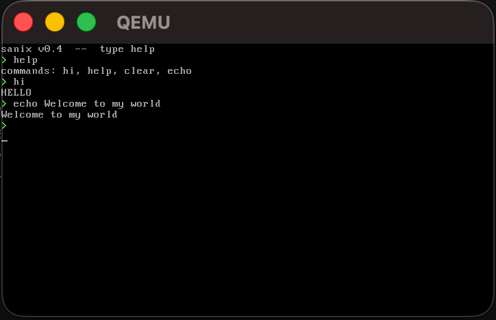

# sanix   


> A minimal x86 bootloader and interactive shell written in pure assembly.  
> No OS. No libc. No abstractions. Just BIOS, RAM, and VGA.

```
BIOS → 0x7C00 → Stage 1 (boot.asm) → 0x7E00 → Stage 2 (stage2.asm) → VGA shell
```

---

## preview



---

## what is this

**sanix** is a from-scratch, two-stage x86 bootloader that boots into a working
interactive terminal shell — entirely in 16-bit real mode. It runs directly on
bare hardware (or QEMU), with no operating system underneath it.

Every byte on screen is written by hand into VGA memory at `0xB8000`. Every
keypress is read directly from the BIOS. There is no kernel, no syscall, no
standard library of any kind.

This is the kind of project that teaches you what actually happens when a
machine turns on.

---

---

## why sanix

This project exists to understand what actually happens when a machine boots.

Instead of using an existing OS or libraries, everything is done manually:
- disk reading via BIOS
- memory management via segments
- direct VGA writes
- raw keyboard input

The goal is clarity, not convenience.

---

## quick start

```bash
chmod +x run.sh
./run.sh
```

QEMU opens a window. You see:

```
sanix v0.4  --  type help
> 
```

Type commands. The shell responds.

---

## shell commands

| command | output |
|---|---|
| `hi` | `HELLO` |
| `help` | `commands: hi, help, clear, echo` |
| `clear` | clears the screen |
| `echo <text>` | prints `<text>`; bare `echo` prints a blank line |
| anything else | `?` |

Backspace works. Scroll works. Screen wraps cleanly at row 24.

---

## how it works

### stage 1 — `boot.asm` (exactly 512 bytes)

The BIOS loads the first sector of the floppy into physical address `0x7C00`
and jumps to it. Stage 1 has one job: load Stage 2 and hand off execution.

- Initialises `DS`, `ES`, `SS`, `SP`
- Calls INT 13h (CHS read) to load 2 sectors from floppy sector 2 into `0x0000:0x7E00`
- Far jumps to `0x0000:0x7E00`
- Ends with the boot signature `0xAA55` at bytes 510–511

### stage 2 — `stage2.asm` (assembled with `org 0x7e00`)

Stage 2 is the actual shell. It runs entirely in real mode with `DS = 0x0000`.

**Startup:**
- Sets `DF = 0` (`cld`) immediately — BIOS leaves the direction flag undefined
- Clears the VGA screen by writing `0x0720` (space + white-on-black) to all 2000 cells
- Prints the banner via direct VGA memory writes

**Shell loop:**
```
print_prompt → read_line → handle_command → repeat
```

**Keyboard input:**
- Reads keys via INT 16h (`xor ah, ah / int 0x16`)
- `cld` called after every INT 16h — BIOS can corrupt the direction flag
- Characters stored in a 64-byte input buffer using `stosb` (`ES:DI`)
- Backspace decrements the buffer pointer and blanks the VGA cell

**Command dispatch:**
- `strcmp` compares input buffer against exact-match commands (`hi`, `help`, `clear`)
- `strcmp_prefix` handles prefix-style commands like `echo` (matches `echo`, `echo hello`, etc.)
- `echo` skips past the command word and any trailing spaces, then prints the remainder via `println`
- Matched command calls `println` with the response string
- `clear` calls `clear_screen` which `rep stosw`s the entire VGA buffer

**VGA output:**
- All output goes through `vga_putchar_attr`
- Cell offset = `(cur_row * 80 + cur_col) * 2`
- Written directly to `ES:BX` where `ES = 0xB800`
- `cur_row` and `cur_col` tracked as 16-bit words in data section

**Scrolling:**
- On newline, if `cur_row >= 25`: scroll triggers
- `scroll` sets `DS = ES = 0xB800`, does `rep movsw` to shift rows 1–24 up to 0–23, clears row 24
- `DS` is pushed before and popped after — critical, since all data variables are accessed via `DS = 0x0000`

---

## project structure

```
sanix/
├── boot.asm         # Stage 1 — MBR, 512 bytes, loads stage 2 via INT 13h
├── stage2.asm       # Stage 2 — shell, VGA output, keyboard input, scroll
├── run.sh           # assemble → disk image → QEMU
└── assets/
    └── preview.png  # screenshot
```

---

## requirements

| tool | purpose |
|---|---|
| `nasm` | assembles `.asm` → flat raw binary |
| `qemu-system-x86_64` | x86 PC emulator with floppy boot support |

Install on macOS:
```bash
brew install nasm qemu
```

---

## technical notes

| detail | value |
|---|---|
| Boot signature | `0xAA55` at bytes 510–511 of sector 0 |
| Stage 2 load address | `0x0000:0x7E00` via INT 13h CHS (cyl 0, head 0, sector 2) |
| Sectors loaded | 2 (covers full 617-byte stage2.bin) |
| VGA buffer base | `0xB8000` (text mode, 80×25) |
| VGA cell format | `[char byte][attr byte]` — `0x07` = white on black, `0x0a` = green |
| Execution mode | 16-bit real mode throughout |
| DS register | `0x0000` at all times except inside `scroll` (saved/restored) |
| Direction flag | explicitly cleared (`cld`) at entry and after every INT 16h call |
| Input buffer | 64 bytes at fixed address in data section |

---

## bugs fixed along the way

These are real bugs that were found and fixed during development — worth
documenting because each one teaches something fundamental.

**Far jump segment mismatch**
Stage 2 was assembled with `org 0x7e00` but the jump was `jmp 0x07E0:0x0000`.
Physical address = `(0x07E0 << 4) + 0 = 0x7E000` — completely wrong page.
Fix: `jmp 0x0000:0x7E00`.

**Register clobber before INT 13h**
`AH` and `AL` (read function + sector count) were set, then `xor ax, ax` was
called to zero `ES` — wiping both. INT 13h fired as a disk reset, stage 2 was
never loaded. Fix: set `ES:BX` first, then set `AH/AL` last.

**Only 1 sector loaded**
`mov al, 1` loaded 512 bytes. Stage 2 is 617 bytes. The second sector —
containing all string data, command table, and input buffer — was never in RAM.
`handle_command` read zeros, matched nothing, printed nothing.
Fix: `mov al, 2`.

**DS clobbered by scroll**
`scroll` sets `DS = 0xB800` for `rep movsw`. Without `push ds / pop ds`,
all subsequent accesses to `cur_row`, `cur_col`, `input_buf` (which are
`DS:offset` with `DS=0x0000`) were reading from VGA memory instead of RAM.
Fix: push/pop DS around the segment change.

**Direction flag trashed by BIOS**
INT 16h (and other BIOS interrupts) do not guarantee DF=0 on return. `stosb`
in `read_line` was writing backwards through the input buffer, corrupting every
keystroke. `strcmp` never matched. Fix: `cld` after every `int 0x16`.

---

## status

```
v0.1  two-stage boot, static VGA text output
v0.2  interactive shell — keyboard input, command dispatch, backspace
v0.3  screen scroll, full terminal behaviour, all bugs fixed
v0.4  echo command, strcmp_prefix helper, version bump
```

---

## roadmap

- [ ] command history (up arrow)
- [ ] custom hardware cursor (INT 10h or direct CRTC port)
- [ ] more commands — `reboot`, `halt`
- [ ] protected mode switch — GDT setup, 32-bit jump
- [ ] memory map — INT 15h `E820`
- [ ] filesystem — read files from floppy sectors
